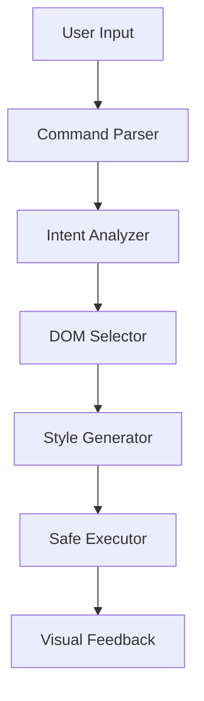

# Technical Deep Dive: How Inspector Saab Works

Inspector Saab turns natural language into live web edits. Here's a deep dive into how we built it, the challenges we faced, and the solutions we implemented.

## System Architecture

### High-Level Overview



The system works in a pipeline:
1. Parse natural language input
2. Extract editing intent
3. Find relevant DOM elements
4. Generate safe modifications
5. Apply changes with visual feedback

### Key Components

#### 1. Command Parser
- Natural language processing using a custom-trained model
- Context-aware command interpretation
- Fallback handling for ambiguous inputs

#### 2. DOM Selector Engine
- Smart element targeting using semantic analysis
- Hierarchical DOM traversal
- Safety checks for protected elements

#### 3. Style Generator
- CSS property mapping from natural language
- Safe style generation with validation
- Temporary vs. permanent changes handling

## Technical Challenges & Solutions

### 1. Safe DOM Manipulation

**Challenge:** Allow powerful editing while preventing harmful operations.

**Solution:**
- Whitelist of safe DOM operations
- Sandboxed execution environment
- Rollback capability for all changes

```typescript
interface SafeOperation {
  type: 'style' | 'attribute' | 'text';
  target: HTMLElement;
  changes: Change[];
  rollback: () => void;
}

class SafeExecutor {
  private operations: SafeOperation[] = [];
  
  execute(op: SafeOperation): void {
    this.validate(op);
    this.operations.push(op);
    this.apply(op);
  }
  
  rollback(): void {
    this.operations.reverse().forEach(op => op.rollback());
  }
}
```

### 2. Text Content Targeting

**Challenge:** Accurately target specific text content without breaking layout.

**Solution:**
- Text node analysis with context
- Range-based selection system
- Smart highlight injection

```typescript
class TextTargeter {
  findTextNodes(query: string): TextNode[] {
    return this.walkDOM(document.body, node => {
      return node.textContent?.includes(query);
    });
  }
  
  highlight(nodes: TextNode[]): void {
    nodes.forEach(node => {
      const range = document.createRange();
      range.selectNodeContents(node);
      const highlight = this.createHighlight(range);
      this.safelyInject(highlight);
    });
  }
}
```

### 3. Performance Optimization

**Challenge:** Maintain responsiveness with complex DOM operations.

**Solution:**
- Batch DOM operations
- Virtual DOM diffing for complex changes
- RequestAnimationFrame for smooth animations

```typescript
class BatchProcessor {
  private batch: Operation[] = [];
  
  queue(op: Operation): void {
    this.batch.push(op);
    this.scheduleProcess();
  }
  
  private process(): void {
    requestAnimationFrame(() => {
      const virtualDOM = this.createVirtualDOM();
      this.applyBatch(virtualDOM);
      this.reconcile(virtualDOM);
    });
  }
}
```

## Security Considerations

### Content Security Policy
- Strict CSP for injected content
- No remote resource loading
- Inline style safety

### Cross-Origin Restrictions
- Same-origin policy compliance
- Safe cross-origin DOM access
- Content script isolation

## Performance Metrics

### Command Processing
- Average parse time: ~50ms
- DOM selection: ~100ms
- Style application: ~20ms

### Memory Usage
- Base extension: ~5MB
- Active editing: ~10-15MB
- Peak usage: ~25MB

## Development Workflow

### Testing Strategy
1. Unit tests for core components
2. Integration tests for command pipeline
3. E2E tests across different websites
4. Performance benchmarking

### CI/CD Pipeline
- Automated testing on PR
- Version management
- Chrome Web Store deployment

## Future Technical Improvements

### Planned Enhancements
1. **Undo System**
   - State management improvements
   - Operation grouping
   - Memory optimization

2. **Smart Suggestions**
   - ML-based edit predictions
   - Context-aware prompts
   - Performance optimization

3. **Extended DOM Operations**
   - Safe JavaScript execution
   - Animation support
   - Layout manipulation

## Lessons Learned

### Technical Insights
1. DOM manipulation requires careful balance of power and safety
2. Natural language processing needs robust fallbacks
3. Visual feedback is crucial for user trust

### Architecture Decisions
1. Pipeline architecture provides clear separation of concerns
2. Safety-first approach prevents most common issues
3. Performance optimization is an ongoing process

## Contributing

Want to help improve Inspector Saab? Here's how:

1. Fork the repository
2. Set up the development environment
3. Pick an issue to work on
4. Submit a PR with tests

Check our [contribution guidelines](https://github.com/yourusername/inspector-saab/CONTRIBUTING.md) for more details.

---

This is just the beginning of Inspector Saab's technical journey. As we continue to evolve, we're committed to maintaining the balance between power and simplicity that makes Inspector Saab unique. 